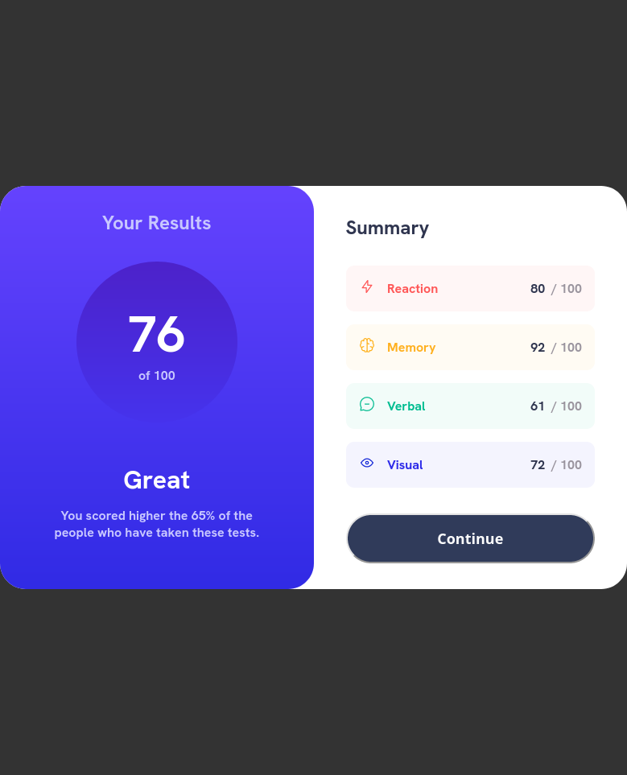
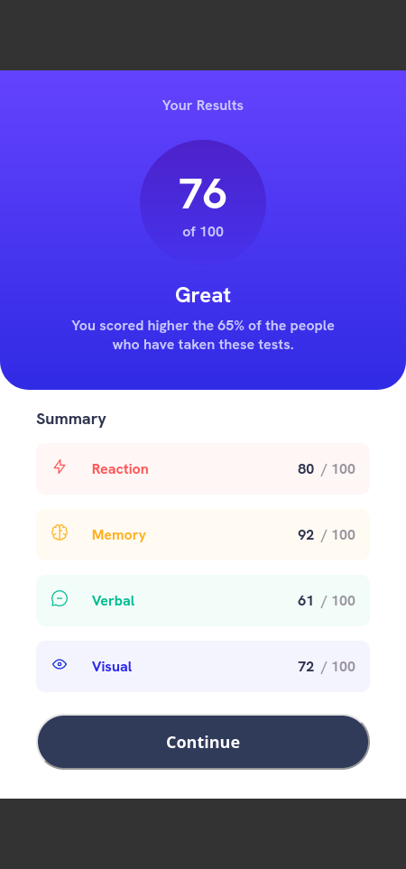

# Frontend Mentor - Results summary component solution

## Overview

This one was fairly straight forward. Nice challenge to overcome a couple quirks I was getting. The spans were giving me some trouble because they wanted to make a new line. Then as with them I couldn't give it proper spacing my numbers were tight to the / but I got it figured out. I think that was the biggest challenge for me.

### Screenshot

